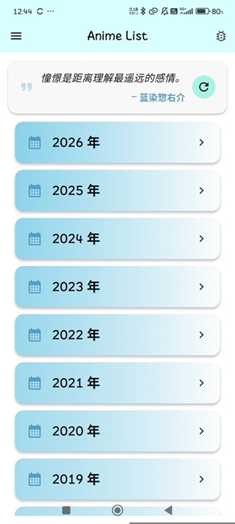
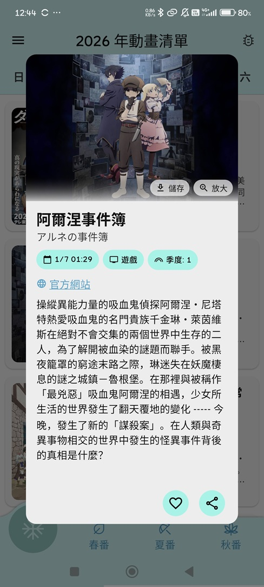

# anime_list

學習Flutter 的練習項目，模仿[Anime List](https://acgntaiwan.github.io/Anime-List/)的手機app

本APP不是看動畫的，就只是單純的展示各種動畫播出資訊而已
理論上只要`Anime List`還有在更新他的資料，我的APP也會跟著更新，但是他有些資料沒有寫播出時間，我的APP就會把它過濾掉

## 程式截圖

## 功能

- 查看各種動畫的播出資訊，日期、原作、季數...
- 收藏動畫
- 點擊動畫封面可以保存圖片

## 開發工具

- flutter: go_router、dio...
- sqlite: 儲存收藏的動畫

## TODO

原本有想到可以做個小工具之類的，但後來問AI發現要做的話需要寫kotlin/java，只靠flutter是做不到的，至少目前是做不到，因此作罷

- [ ] 上架google play
要上架google play要有人幫忙測試，SO 如果覺得這個APP有用的話請聯繫我(<a0985209465@gmail.com>)，我會給你google play測試連結，幫忙增加測試人數，感謝!!!

- [ ] 收集意見，如果你有任何建議、問題都歡迎提出
