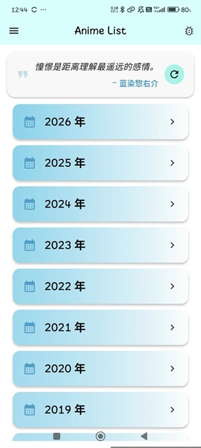
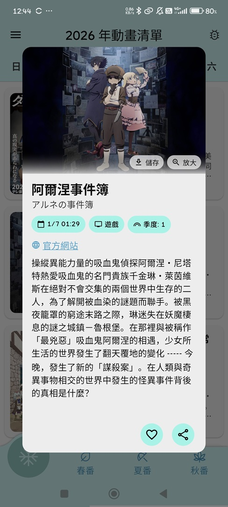
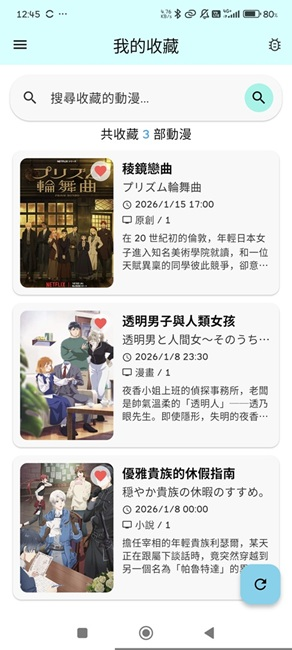

# anime_list

學習Flutter 的練習項目，模仿[Anime List](https://acgntaiwan.github.io/Anime-List/)的手機app

本APP不是看動畫的，就只是單純的展示各種動畫播出資訊而已
理論上只要`Anime List`還有在更新他的資料，我的APP也會跟著更新，但是他有些資料沒有寫播出時間，我的APP就會把它過濾掉

## 程式截圖

## 功能

- 查看各種動畫的播出資訊，日期、原作、季數...
- 收藏動畫
- 保存封面圖片、分享動漫資訊
- 深色 / 淺色主題切換
- 檢查 App 更新
- 意見回饋（email）

## TODO

- [ ] 上架 Google Play
  要上架 Google Play 要有人幫忙測試，如果覺得這個 APP 有用的話請聯繫我（<a0985209465@gmail.com>），我會給你 Google Play 測試連結，幫忙增加測試人數，感謝！
- [ ] 桌面小工具
